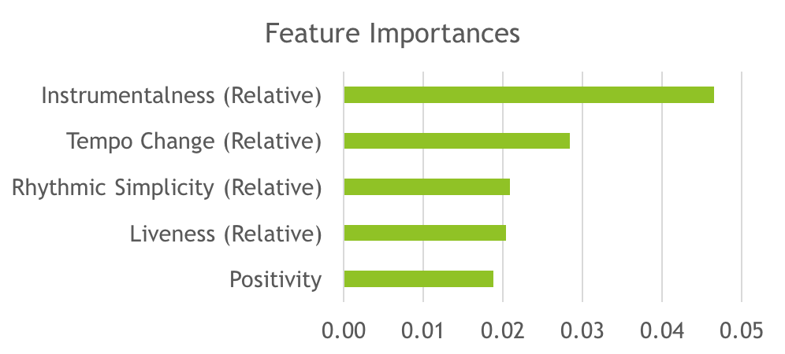
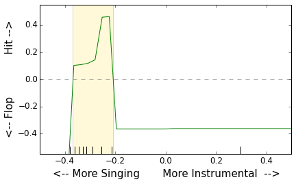
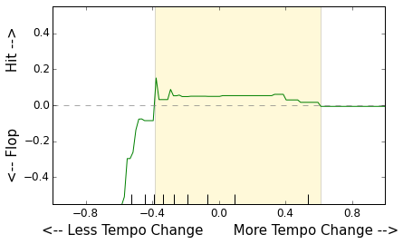
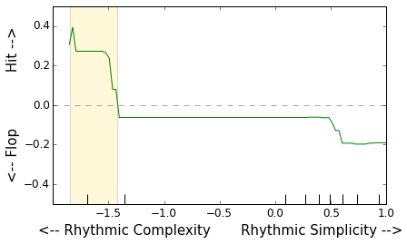
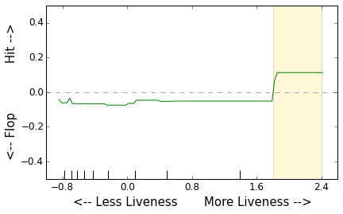
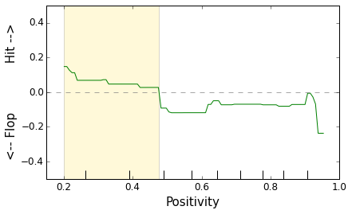

## Music Megahits

In this project, I analyze audio features of hit pop songs in order to answer the question of what makes certain hit pop songs stay on the charts week after week while others drop off. I also explored whether it is advantageous for a song to be right on trend with what is popular, or to be distinctive and differentiate itself with a different sound.

### Data Collection
&nbsp;&nbsp;&nbsp;&nbsp;&nbsp;&nbsp;&nbsp;
 
* I built a scraper for the Billboard Top 100 Pop singles chart.

* I cleaned the data extensively. This was important because songs and artists were often listed in two different ways (e.g., "Living on a Prayer" vs. "Livin' on a Prayer".)

* I aggregated the data based on a combination of artist and song to get a count of how many weeks each song was in the charts.

* I defined a hit as a song that was on the charts for more than 20 weeks, and a flop as one that was on for five weeks or fewer. I also restricted the data set to the years 1980-2005, because this was a period where the ratio of hits to flops was fairly stable.

&nbsp;&nbsp;&nbsp;&nbsp;&nbsp;&nbsp;&nbsp;
 
* For the audio features, I used Echo Nest’s API, which provides an extensive list of features available by song. In order to improve my success rate of retrieving Echo Nest data, the module I wrote to call Echo Nest's API re-tries unsuccessful searches with a number of transformations on the song and artist name from Billboard, e.g. removing punctuation or removing the word 'the.' With this method, I was able to find Echo Nest data for 84% of the ~34,000 tracks I searched.

* Echo Nest features are produced using machine learning algorithms. They cover both straightforward aspects of the song, such as the key and time signature, as well as assessments of a song’s more subjective qualities such as danceability and positivity. Echo Nest data comes in JSON format. I parsed these files to extract audio features for each song.

### Feature Engineering
To supplement the Echo Nest features, I calculated two sets of additional features:

* **Change:** I calculated the degree of change within a song, for instance in tempo and volume. I did this by calculating the standard deviation of measures that were taken repeatedly. For instance, the change in tempo is measured by calculating the standard deviation of the length in seconds of each bar in the song.

* **Distinctiveness:** I calculated how different the song was on each of the features from other songs that were popular during the same time. To do this, I identified a “cohort” for each song, i.e., a list of other songs that were on the charts during the same weeks. Then I normalized the song's features using the mean and standard deviation of these features.

### Modeling

My final data set contained 116 features for just over 2500 songs. I compared the results of several machine learning algorithms. Gradient Boosting fit the best, with an ROC-AUC score of .70. Looking at the top five predictors, it’s interesting to note that four out of the five are relative features. These are the features I engineered to measure *distinctiveness*.

##### Top Predictors

 

##### Partial Dependence Plots
Note: The curve is above zero for the values of the feature for which the model would predict that a song is a hit.

 
 

 
 

 
 

 
 

 

### Libraries Used
* Pandas
* Numpy
* Scipy
* Scikit-learn
* Statsmodels
* Beautiful Soup
* Matplotlib
